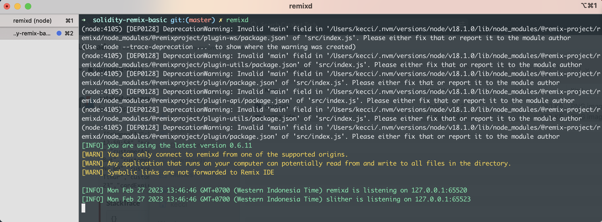
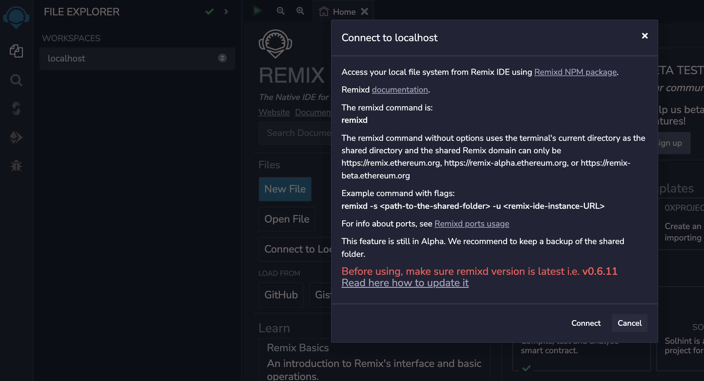
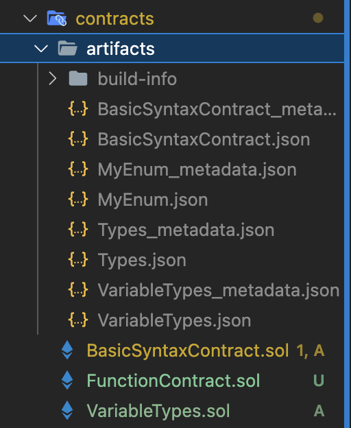
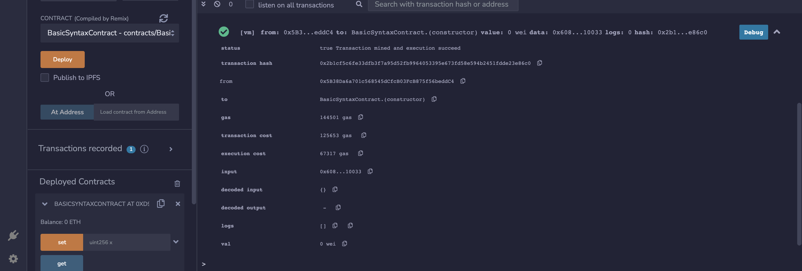
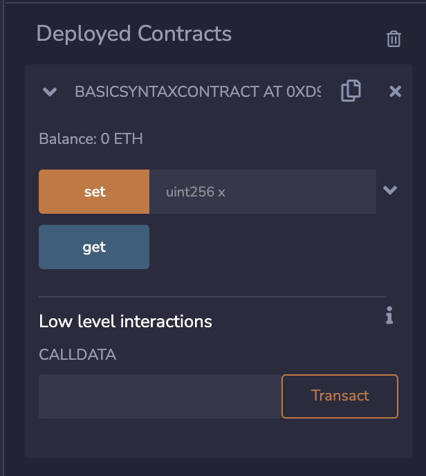
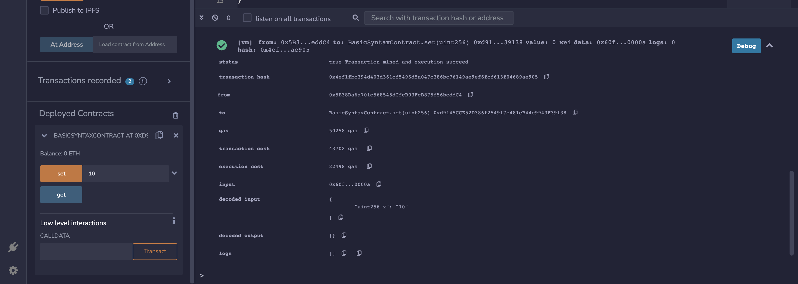
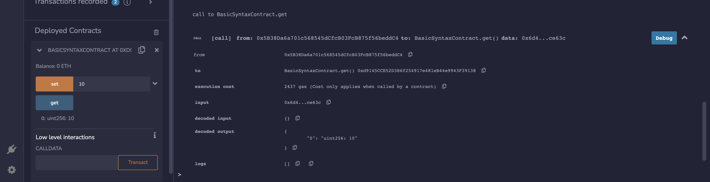

# solidity-remix-basic

## Table of Contents
- [solidity-remix-basic](#solidity-remix-basic)
  - [Table of Contents](#table-of-contents)
  - [Basic Syntax](#basic-syntax)
    - [1. Version Line](#1-version-line)
    - [2. Contract Line](#2-contract-line)
    - [3. Variable Line](#3-variable-line)
    - [4. Function Line](#4-function-line)
  - [Basic Usage](#basic-usage)
    - [Remix IDE](#remix-ide)
    - [Workspace](#workspace)
    - [Remixd](#remixd)
    - [I. Compile Contract](#i-compile-contract)
    - [II. Deploy Contract](#ii-deploy-contract)
    - [III. Transaction Contract](#iii-transaction-contract)
  - [Variable and Types](#variable-and-types)
  - [Function](#function)
    - [Basic function](#basic-function)
    - [Payable function](#payable-function)
    - [Overload function](#overload-function)
    - [Fallback and receive functions](#fallback-and-receive-functions)
  - [Address](#address)
    - [Address of Sender](#address-of-sender)
    - [Address of Smart Contract](#address-of-smart-contract)
    - [Transfer \& Send Address](#transfer--send-address)
  - [Location](#location)
    - [Storage vs memory](#storage-vs-memory)
    - [Reference \& Copy Location](#reference--copy-location)
  - [Array](#array)
    - [Fixed Array](#fixed-array)
    - [Dynamic Array](#dynamic-array)
    - [Length Array](#length-array)
    - [Push array (insert, last insert)](#push-array-insert-last-insert)
    - [Pop (last out)](#pop-last-out)
  - [Struct](#struct)
    - [Struct data function insert](#struct-data-function-insert)
    - [Struct data inline insert](#struct-data-inline-insert)
    - [Struct data array](#struct-data-array)
  - [Mapping](#mapping)
    - [Mapping](#mapping-1)
    - [Nested Mapping](#nested-mapping)
  - [Contract](#contract)
    - [Parent Contract](#parent-contract)
    - [External Contract](#external-contract)
    - [Inheritence Contract from Parent](#inheritence-contract-from-parent)
  - [Source](#source)

## Basic Syntax
First we want to look at the basic syntax in solidity code. For example code on here: [/contracts/BasicSyntaxContract.sol](/contracts/BasicSyntaxContract.sol)

or it look like this:
```solidity
pragma solidity >=0.7.0 <0.9.0;

contract BasicSyntaxContract {
    // init variables
    uint storedData;
    
    // set storedData   
    function set(uint x) public {
        storedData = x;
    }
    
    // get storedData
    function get() public view returns (uint) {
        return storedData;
    }
}
```

There is always 4 components for the syntax line:
1. Version Line
2. Contract Line
3. Variable Line
4. Function Line

### 1. Version Line
```solidity
pragma solidity >=0.7.0 <0.9.0;
```

### 2. Contract Line
```solidity
contract BasicSyntaxContract {
    ....
    // Here we define variables and functions
}
```

### 3. Variable Line
```solidity
    // init variables
    uint storedData;
```

### 4. Function Line
```solidity
    // set storedData   
    function set(uint x) public {
        storedData = x;
    }
```

## Basic Usage

### Remix IDE
To running the contract we use Remix IDE on https://remix.ethereum.org/


### Workspace
There is 2 types of workspaces:
1. local browser (default)
2. local filesystem (localhost, we need to use `remixd`)

### Remixd
To install remixd and usage, you can follow: https://remix-ide.readthedocs.io/en/latest/remixd.html

Here simple steps:
1. Install remixd
2. Run remixd on the directory/folder where it is the workspace, command: `remixd` 
3. Choose workspace on remix-ide on `localhost`. 
4. Done, connected to localhost. 


### I. Compile Contract
After we choose our `workspace`, we can compile the contract that we code before. 

> To compile the contract, we need to choose the `(contract-name)` of `file-name.sol`. 
> 
> For Example:
> 
> `(BasicSyntaxContract) BasicSyntaxContract.sol`

Here is the illustration to compile the contract:


So the steps to compile are:
1. Choose the contract and file
2. Submit `Compile contract`. 
3. It generated an `artifacts file` on your contracts folder. 

### II. Deploy Contract


In deploy sections, we can see some input:
- Environments -> The Virtual Machine that we use
- Accounts -> Address account that want to use
- Gas limit -> Limit gas
- Value -> value of cost, we can use `wei` or `eth`
- Contract -> contract that we want to deploy

Steps:
1. We input all the form deployment
2. Submit deploy
3. Deployed to transaction section and our eth address will cutted for the creation of contract. 

### III. Transaction Contract
After we deploy, we can see in the deployed contracts section. Some form of interface our transaction of the contract.

In the code before, we have 2 functions:
1. `function set` -> to set the data
2. `function get` -> to get the data

We also can see the result if the interface are generated on the deployed contracts.



Here example the transactions the submit button & logs:
- set with the input with 10 value. 
- get the data for 10 value. 

## Variable and Types
After we know basic syntax and basic usage, we want to know deep about variables and types of sol, we can see the example code on here: [/contracts/VariableTypes.sol](/contracts/VariableTypes.sol)

## Function
After we know basic syntax, usage, variables, and types, we want to know more usage of functions.

### Basic function
```solidity
contract HelloWorld {
    uint hasil;

    function printHello() public pure returns(string memory) {
        return 'Hello World';
    }

    function tambah(uint a, uint b) public {
        // local
        uint temp = a + b;

        // need to save to local variable first, then we set to global variable
        hasil = temp;
    }

    function getHasil() public view returns(uint) {
        return hasil;
    }
}
```

### Payable function
```solidity
contract PayableContract {
    uint receivedAmount;

    // we need to define the function with `payable`
    function savedEther() payable public {
        // we can use `msg.value` from the form input of the deployed contract
        receivedAmount = msg.value;
    }

    function getTotalAmount() public view returns(uint) {
        return receivedAmount;
    }
}
```

### Overload function
```solidity
contract OverloadContract {
    // Overload -> namanya bisa sama, tapi parameternya berbeda
    function tambah(uint a, uint b) public pure returns(uint hasil) {
        hasil = a + b;
        // fungsi overload tidak boleh ada return
    }
    function tambah(uint a, uint b, uint c) public pure returns(uint hasil) {
        hasil = a + b + c;
        // fungsi overload tidak boleh ada return
    }
}
```

### Fallback and receive functions

- Fallback: https://docs.soliditylang.org/en/v0.8.17/contracts.html#fallback-function
- Receive: https://docs.soliditylang.org/en/v0.8.17/contracts.html#receive-ether-function

```solidity
contract FallbackReceiveContract {
    uint x;
    uint y;
    // This function is called for all messages sent to
    // this contract, except plain Ether transfers
    // (there is no other function except the receive function).
    // Any call with non-empty calldata to this contract will execute
    // the fallback function (even if Ether is sent along with the call).
    fallback() external payable { x = 1; y = msg.value; }

    // This function is called for plain Ether transfers, i.e.
    // for every call with empty calldata.
    receive() external payable { x = 2; y = msg.value; }
}
```

## Address

You can see the code on here: [/contracts/AddressContract.sol](/contracts/AddressContract.sol)

### Address of Sender
```solidity
    address public caller;

    // Address of sender: 2 kali action, pertama di set, baru di get caller nya
    function getCallerAddress() public returns(address) {
        caller = msg.sender;
        return caller;
    }

    // Address of sender: Lebih ringkas daripada function sebelumnya, langsung set & get.
    function getCallerAddressWithView() public view returns(address caller) {
        caller = msg.sender;
    }
```

### Address of Smart Contract
```solidity
    function getAddressThis() public view returns(address) {
        address myAddress = address(this);
        return myAddress;
    }
```

### Transfer & Send Address
```solidity
    // Set Saldo
    uint receivedAmount;

    // Constant for 1 ether to wei
    uint ether1 = 1000000000000000000;

    // Add ether balance to smart contract
    function receiveEther() payable public {
        receivedAmount = msg.value;
    }

    // Address payable, there is 2 type: send and transfer
    function transferEther(address payable _address, uint amount) public {
        // _address -> address of receiver
        _address.transfer(amount * ether1);
    }

    // Send
    function sendFund(address payable _address, uint amount) public returns(bool) {
        // _address -> address of receiver
        _address.send(amount * ether1);
    }
```

## Location

You can see the code on here: [/contracts/LocationContract.sol](/contracts/LocationContract.sol)

Ada 4 tipe penyimpanan smart contract:
1. storage: lokasi penyimpanan sifatnya permanen (disemua fungsi). seperti hardisk. state variable. gas lebih besar.
2. memory: gas lebih kecil. hanya bisa di akses di fungsi saja. seperti ram.
3. calldata: lokasi tidak dapat di modification, lalu sifatnya tidak persistent / tetap, lokasi default parameternya.
4. stack: data sifat nya non-persistent, mirip calldata. dikelola langsung oleh vm ethereum. menggunakan lokasi data stack tersebut untuk variable selama ada eksekusi. sampai 1024 level.


### Storage vs memory
```solidity
    // storage
    bool isReady; // storage
    string name; // storage

    function iniFungsi() public {
        // values 
        bool isOk; // memory
        uint number; // memory
        address account; // memory
    }
```

### Reference & Copy Location 

Copy Location:
```solidity
    function iniValue() public pure returns (uint) {
        uint localVar1 = 10;
        uint localVar2 = 20;

        localVar1 = localVar2; // copy, bukan reference, tidak reflection
        localVar1 = 40; 

        return localVar1; // 40
    }
```

Reference Location:
```solidity
    function iniFungsi() public pure returns (uint[] memory, uint[] memory) {
        uint[] memory localMemoryArray1 = new uint[](3);

        localMemoryArray1[0] = 1;
        localMemoryArray1[1] = 2;
        localMemoryArray1[2] = 3;

        uint[] memory localMemoryArray2 = localMemoryArray1; // reference, bisa reflection
        localMemoryArray1[0] = 10; // berpengaruh pada memory1 & memory2 (karena reference)

        return (localMemoryArray1, localMemoryArray2); // isinya sama (10, 2, 3) & (10, 2, 3)
    }
```

## Array
You can see the code on here: [/contracts/ArrayContract.sol](/contracts/ArrayContract.sol)

### Fixed Array
```solidity
// Fixed
contract ArrayContract {

    function getData() public pure returns (uint[5] memory) {
        uint[5] memory data = [uint(50), 60, 70, 80, 100];
        return data;
    }

    function getSingleData() public pure returns (uint) {
        uint[5] memory data = [uint(50), 60, 70, 80, 100];
        return data[1]; // 60, karena index start dari 0.
    }

    uint[5] datas; // state variable, public dan permanent

    function getDataPublic() public returns (uint){
        datas = [uint(50), 60, 70, 80, 100]; // fixed array
        return datas[1];
    }
}
```

### Dynamic Array
```solidity
// Dynamic
contract DynaimcArrayContract {
    /* Cara 1: Using inline */
    uint[] data;

    function getData() public returns (uint[] memory) {
        data = [60, 70, 30, 40];
        return data;
    }

    /* Cara 2: Using new empty */
    uint[] dataNew;

    function getDataNew() public returns (uint[] memory) {
        dataNew = new uint[](3);
        
        dataNew[0] = 10;
        dataNew[1] = 20;
        dataNew[2] = 30;

        return dataNew;
    }
}
```

### Length Array
```solidity
contract ArrayLenghtContract {
    uint[7] data;

    function arrayExample() public payable returns (uint[7] memory) {
        data = [uint(10), 20, 30, 40, 50, 60];
        return data;
    }

    function arrayLength() public returns (uint) {
        uint x = data.length;
        return x;
    }
}
```

### Push array (insert, last insert)
```solidity
contract PushArrayContract {
    uint[] arr;

    function insert() public returns (uint[] memory) {
        arr = [1, 2, 3];

        //Push array 
        arr.push(4);
        arr.push(5);

        return arr; // 1, 2, 3, 4, 5
    }
}
```

### Pop (last out)
```solidity
contract PopArrayContract {
    uint[] arr;

    function pop() public returns (uint[] memory) {
        arr = [1, 2, 3];

        //Push array 
        arr.pop();
        arr.pop();

        return arr; // 1
    }
}
```

## Struct

```solidity
    struct Book {
        string title;
        string author;
        uint id;
        bool isReady;
    }
```

### Struct data function insert
```
    Book book1;

    function addBook() public {
        book1 = Book("pemograman solidity", "john", 1, true);
    }

    function getBook() public view returns (string memory, string memory, uint, bool) {
        return (book1.title, book1.author, book1.id, book1.isReady);
    }
```

### Struct data inline insert
```solidity
    Book book2 = Book("membuat dapps", "kennedy", 12, false);

    function getBook2() public view returns (string memory, string memory, uint, bool) {
        return (book2.title, book2.author, book2.id, book2.isReady);
    }
```

### Struct data array
```solidity
    Book[] public books;

    function newBook(string memory title, string memory author, uint id, bool isReady) public {
        books.push(Book(title, author, id, isReady));
    }

    function infoBook(uint _index) public view returns (string memory, string memory, uint, bool) {
        Book storage book = books[_index];
        return (book.title, book.author, book.id, book.isReady);
    }
```

## Mapping
You can see the code on here: [/contracts/MappingContract.sol](/contracts/MappingContract.sol)

### Mapping

```solidity
contract MappingContract {
    mapping(address => uint) public myMap;
    
    function set(address _addr, uint _i) public {
        myMap[_addr] = _i;
    }

    function get(address _addr) public returns (uint){
        return myMap[_addr];
    }
}
```

### Nested Mapping
```solidity
contract NestedMappingContract {
    mapping(address => mapping(uint => bool)) public nested;

    function set(address _addr, uint _i, bool _boo) public {
        nested[_addr][_i] = _boo;
    }

    function get(address _addr, uint _i) public returns (bool){
        return nested[_addr][_i];
    }
}
```

## Contract


There is several types of contract:
1. public - all can access
2. external - cannot be accessed internally, only externally
3. internal - only this contract and contract deriving / inheritence from it can access
4. private - can be accessed only from this contract


You can see the code on here: [/contracts/Contract.sol](/contracts/Contract.sol)

### Parent Contract
```
contract Parent {
    uint private data;
    
    uint public info;

    // initialization (dijalankan pertamakali)
    constructor() {
        info = 10;
    }

    function increment(uint a) private pure returns (uint) {
        return a + 1;
    }

    function setIncrement() public pure returns (uint) {
        // bisa menggunakan private function, karena dalam 1 contract.
        return increment(2);
    }

    // public
    function updateData(uint a) public {data = a;}
    function getData() public view returns (uint) { return data; }
    function compute(uint a, uint b) internal pure returns (uint) {return a + b;}
}
```

### External Contract
```
contract ExternalContract {
    function readData() public returns (uint) {
        Parent c = new Parent();
        c.updateData(7);
        return c.getData();
    }
}
```

### Inheritence Contract from Parent
```
contract NewContract is Parent {
    uint private result;
    Parent private c;

    constructor() {
        c = new Parent();
    }

    function getComputeResult() public {
        result = compute(3, 5);
    }

    function getResult() public view returns(uint) {
        return result;
    }

    function getInfo() public view returns(uint) {
        return c.info();
    }
}
```

## Source
- https://www.youtube.com/watch?v=s-OhwH1gs9w&list=PLH1gH0TmFBBhvZi4kEqU6kCjyv_y8qBae